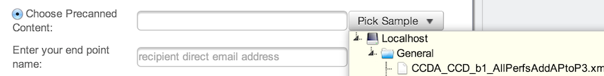

# Testing Your DIRECT Instance

The Trust Anchor for the [DIRECT Transport Sandbox](http://sitenv.org/web/sit/direct-transport/) is now a part of the Patients-Test and Providers-Test Bundles located at https://secure.bluebuttontrust.org/. This means that once your application or service is Blue Button+ enabled following the guidelines listed here you can test your application using the Standards Implementation & Testing Environment. SITE is home to testing tools, sample data, and community driven issue support related to implementers seeking guidance in meeting certification requirements.

0. Make sure you **register your service's anchor** at https://secure.bluebuttontrust.org/submitanchor.aspx
Be sure to select Patients-Test and/or Providers-Test when registering.

1. You will receive a confirmation about your inclusion into the Blue Button + ecosystem at the contact e-mail address provided.

2. Visit http://sitenv.org/web/sit/direct-transport/

3. Use the SITE platform "Receive" section by entering the recipient DIRECT address for a user on your app (e.g. testuser@direct.yourapp.org)
	 
	You can **select your own content** (C-CDA). We recommend using:
	- [SMART's Sample C-CDAs](https://github.com/chb/sample_ccdas) or
	- EMERGE's synthetic samples. (coming soon) 

If you **use your own C-CDAs**, please run them through the [SMART C-CDA Scorecard](http://ccda-scorecard.smartplatforms.org) to ensure that your C-CDAs are following best practices.

Or you can choose **built-in content from SITE** via the "Pick Sample" dropdown. 

4. A message will be sent to the address provided.

5. For simulating a patient sharing their C-CDA with another provider, you can send a direct message to [provider1@direct.sitenv.org](mailto:provider1@direct.sitenv.org "provider1@direct.sitenv.org"). The sandbox will send you a response back on receipt of the message.

For general support, questions or feedback use the [FAQ](http://forum.sitenv.org/faq.php?sid=e53ef049de59c897fd484f8b72d1a53f) and [Community Forum](http://forum.sitenv.org/) sections. These are great resources for developers looking to meet Meaningful Use and C-CDA requirements.

If you are still having technical difficulties using the SITE tools or services contact the admin help desk at [admin@sitenv.org](mailto:admin@sitenv.org)

For any Blue Button or Blue Button+ inquiries reach out to [rebecca.mitchell@hhs.gov](mailto:rebecca.mitchell@hhs.gov) 
