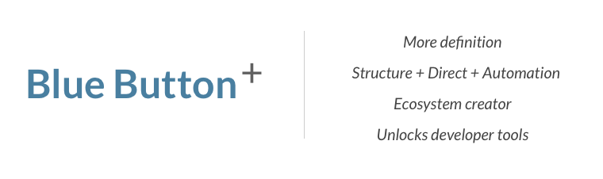

# Evolution of Blue Button

Blue Button is a simple concept: give patients’ access to their own data. VA started the movement three years ago by adding a simple button to their portal, which allowed users to download their medical records in digital form.

Since then, millions of Veterans have logged onto the tool to download their personal health information, and many of the country’s largest data holders, including federal agencies such as the Centers for Medicare & Medicaid Services (CMS) and the Department of Defense (DoD) and private health plans such as United HealthCare and Aetna, have embraced Blue Button as a way to make health care data readily available to their beneficiaries.

With this implementation guidance, we are evolving the requirements associated with the Blue Button. Dataholders (such as providers and payors, and their vendors) and receivers (such as PHRs and other apps and services) that choose to follow this guidance will be known as providing “Blue Button+” to their users.

Blue Button+ gives users the ability to get records in a human-readable and machine-readable format; and to send them where they choose. This enables a consumer to do everything from printing a physical copy to sharing it with a third party application.
