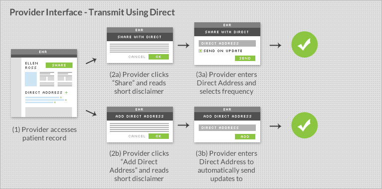
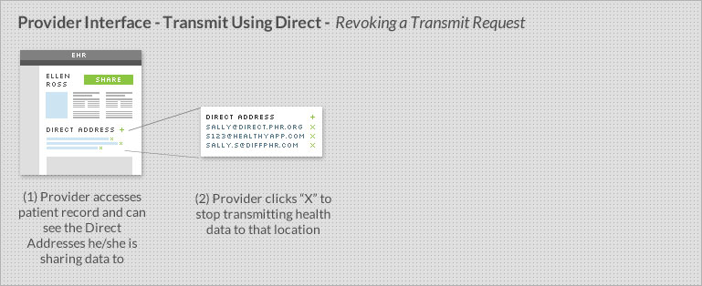

# Transmitting Data Using the Direct Protocol

This section describes the use of the [Direct Project](http://directproject.org) specification to transmit health data securely from a ***data holder*** to a ***third party***. Implementation of Direct protocol is required for Meaningful Use Stage 2 CEHRT.

Examples of data holder systems include: provider's EHR, health insurance claims database, or pharmacy dispensing system. Examples of third parties include: personal health records, mobile applications, or web services.

## 1. Technical

### A. Authentication
A patient's identity must be validated before a transmission of his/her data can occur. In the case of a patient portal, a patient or their authorized representative is authenticated by logging in using previously-validated credentials.  In the case of a live interaction identity validation may be needed, and can be obtained orally or in writing., If the provider already knows the individual, no additional steps are needed to verify the individual’s identity.

These requirements are the same identity assurance and authentication requirements sufficient to meet the View and Download portions of View, Download, and Transmit requirements in Meaningful Use Stage 2.

See [Blue Button+ Privacy and Security Related Questions](privacy.html) for more guidance.

### B. Handling a Patient's Request for Transmit

A patient's request for sharing their data will include:

1. Authorization for transmit
2. Frequency preferences
3. Destination Direct address(es) 

A system must be able to receive these three pieces of information from a patient before transmitting their information. These pieces of information may be received via a patient portal or via a provider interface. The patient must also have the ability to revoke a transmit request.

#### 1. Authorization 
Patient access to his or her own health information is a right under the HIPAA Privacy Rule. This request may be made verbally or in writing. The provider may require a written request for access from the patient obtained either as a feature of the patient portal or offline. For auditing purposes, the authorization should be recorded.

See [Blue Button+ Privacy and Security Related Questions](privacy.html) for more guidance.

#### 2. Frequency Preferences

A system must allow the user to set and change at least two options for transmit frequency:

1. Send a single one-time push of health information to the supplied Direct address(es)
2. Continually push health information to the supplied Direct address(es) when the patient record is updated (See [Triggers](#triggers))

Other frequencies are permitted and can be provided by the implementer.

#### 3. Direct Addresses

A system must be able to accept one or more Direct Addresses, supplied by the patient. A Direct address may look like ellen.ross@somephr.org or jack.smith@direct.someapp.com. 

- For field validation, a Direct address follows the form of an email address.
- For certificate validation, all legitimate addresses will have corresponding public certificates discoverable via DNS or LDAP. (See Section 5 of the [Direct Applicability Statement](http://wiki.directproject.org/Applicability+Statement+for+Secure+Health+Transport+Working+Version))

### C. Revoking Transmit Request

Patients may not revoke authorization retrospectively, but must be able to revoke authorization prospectively. There must be a mechanism in the provider interface and patient portal to enable the user to terminate all future transmissions.

### D. Transmitting Using Direct

The [Direct Project](http://wiki.directproject.org/Documentation+Library) offers a specification for how existing standards can be used to securely transport health information over the Internet. Direct uses SMTP, S/MIME, and X.509 certificates to achieve security, privacy, data integrity, and authentication of sender and receiver sufficient to meet the data transport needs of health information exchange.

As a data holder, you will need to send patient health information from your system to a Direct address. In order to do that, your system needs to be able to send that payload through a Security/Trust Agent (STA). An STA uses SMTP and S/MIME to ensure messages and their payload are delivered securely. An STA can be a component internal to your system, or hosted externally.

When an STA is hosted externally, it is usually by a Health Information Services Provider (HISP).

A STA following Stage Two guidance should be able to:
- ***Send***: A message and its payload must be sent via SMTP
- ***Encrypt***: Messages will be encrypted using S/MIME
- ***Use Encryption Certificates***: A STA must discover certificates via DNS or LDAP to encrypt messages (See Section 5 of the [Direct Applicability Statement](http://wiki.directproject.org/Applicability+Statement+for+Secure+Health+Transport+Working+Version))
- ***Validate Certificates***: Confirm the Certificates are current, valid and Direct-compliant (See Section 4 of the [Direct Applicability Statement](http://wiki.directproject.org/Applicability+Statement+for+Secure+Health+Transport+Working+Version))

Blue Button+ requires the STA to be configured to:

- ***Retrieve Trust Anchor Bundle***: A STA should automatically retrieve the latest Blue Button+ trust bundle
- ***Sign Messages w. Certificate***: Outbound messages should be [signed by a certificate](#certificates).

Your system will communicate the payload and destination Direct address to a STA/HISP. It will most likely be via REST or SOAP, but this can differ from system to system.

Sample code: [.NET Reference Implementation](http://wiki.directproject.org/CSharp+Reference+Implementation), and [Java Reference Implementation](http://wiki.directproject.org/Java+Reference+Implementation).

Learn more: [Direct Project's Documentation Library](http://wiki.directproject.org/Documentation+Library) and [Direct Project's Applicability Statement for Secure Health Transport](http://wiki.directproject.org/Applicability+Statement+for+Secure+Health+Transport)

#### Retrieving Blue Button+ Patient Trust Bundle {#bundle}
Your STA/HISP will need a set of trust anchors in order to transmit Direct messages. The ***Patient*** bundle includes the trust anchors from third party applications in the Blue Button+ ecosystem. The certificate bundle can be retrieved from:


https://secure.bluebuttontrust.org


The bundle format is ***PKCS7*** which has a ***.p7b*** extension. The bundle should be retrieved and loaded into the STA/HISP daily.

#### Signing with a Certificate {#certificates}
Your STA/HISP will need to sign messages before they are transmitted. Messages can be signed by multiple certificates. 

The preferred path is to use a certificate obtained from a certificate issuer such as a Certificate Authority or HISP that is a member of a trust community within the Direct Project ecosystem (e.g., [Direct Trust](http://directtrust.org)). These communities aggregate trust anchors from those members that issue certificates and publish them within trust anchor bundles.

If you are not participating in one of those communities, one of the signing certificates must be an extended validation (EV) certificate from a reputable vendor.

For testing, you can upload your anchor to the ***Providers-Test*** [Blue Button+ Trust Bundle](https://secure.bluebuttontrust.org/). For production, you will need to participate in a trust community or sign the message with an EV certificate.

#### Detailed Flow Diagram
The following diagram depicts a successful transmission. See it [full-size](files/patient-transmit.pdf).

### E. Automation and Triggers {#triggers}

When the patient has requested "ongoing" sharing of information, the data holder's system will have to use internal triggers that will cause new information to be sent. How this is done will differ from system to system, but we suggest the following as a starting point:

***Triggers for Clinical Systems***:
- Discharge or transition to a new care setting (Acute/ER/Inpatient)
- End of encounter (Ambulatory)
- Any time significant new information is received (e.g., new image or lab report)

***Triggers for Payer Systems***:
- New adjudicated claims data is available
- New explanation of benefits is available

Other triggers are permitted and encouraged. It is up to the implementer. Systems that are unable to implement triggers should investigate transmitting records at predetermined time intervals.

### F. Payload

When a transmission occurs, the following should be part of the payload as a multi-part MIME:
1. Clinical Summary
2. Additional Documents
3. Transmit Context
4. Request.txt (Optional)

#### 1. Clinical Summary
The primary content of the transmission will be the [***Clinical Summary***](healthrecords.html), which is the entire patient's health history in the EHR.

The content format shall use the [Consolidated CDA w. Meaningful Use Stage 2 Sections and Fields](healthrecords.html) and have a MIME type of application/xml. If the data holder has not yet adopted MU Stage 2, they may alternatively use the data elements and format required by MU Stage 1 for a Continuity of Care Document / C32.

#### 2. Additional Documents
Depending on the trigger or type of encounter, it may also be appropriate to include one of the following:
- ***Transition of Care / Referral Summary***
- ***Ambulatory Summary***
- ***Inpatient Summary***

The payload may include other documents as well.

#### 3. Transmit Context
The message body should also include attribution that this transmission was on behalf of the patient in text/plain or text/html:


This message was sent by [Data Holder Name] at the request of [Patient Name].


An example of what that body text would look like:


This message was sent by Ashby Medical Center at the request of Ellen Ross.


#### 4. Request.txt (Optional)
In addition to the friendly message in the body, you should include a ***request.txt***. This is a simple way, much like [robots.txt](http://www.robotstxt.org/robotstxt.html) works to provide some semi-structured context to machines.


Destination: [Direct Address]
Patient: [Patient Name]
Data-holder: [Data Holder Name]
Recurring: [Yes / No]


An example of what a request.txt would look like:


Destination: ellen.ross@somephr.org
Patient: Ellen Ross
Data-holder: Ashby Medical Center
Recurring: Yes


### G. Workflow

The storyboards below match the key user flows described above: (1) within the patient portal and (2) within the provider's EHR interface.

